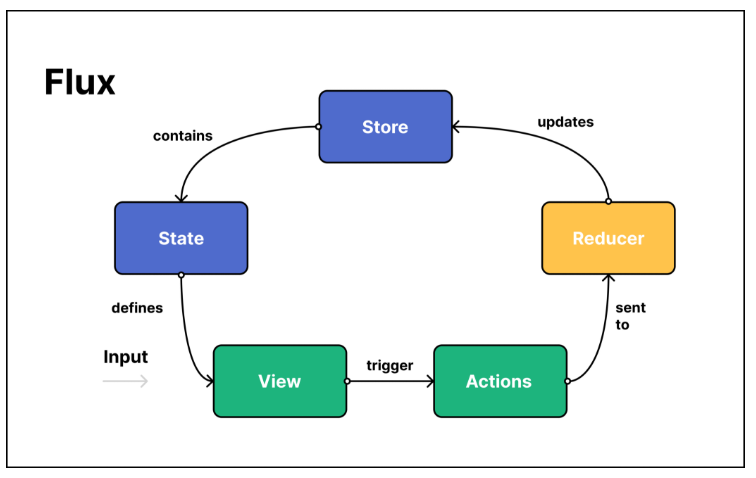

# Zustand API 개발 가이드

이 프로젝트는 React와 Zustand를 활용하여 사용자 목록을 관리하는 예제입니다. 
아래 단계별 가이드를 따라하면 쉽고 빠르게 zustandApi 기능을 개발할 수 있습니다.

---

## 1. 프로젝트 구조 이해

```
src/
  pages/
    zustandApi/
      index.jsx         # 메인 페이지 (UserList 포함)
      UserList.jsx      # 사용자 목록 컴포넌트
      UserItem.jsx      # 사용자 목록의 각 사용자(행) 렌더링 컴포넌트
      UserDetail.jsx    # 사용자 상세/수정/추가 컴포넌트
  store/
    userZstore.js      # Zustand 사용자 스토어
```

---

## 2. Zustand 스토어(userZstore.js) 준비

- 사용자 목록, 로딩/에러 상태, CRUD 액션 함수들을 정의합니다.
- `fetchUsers`, `addUser`, `updateUser`, `deleteUsers`, `getUserById` 등 비동기 함수 포함.
- 예시:
  ```js
  const useUserZStore = create(
    devtools((set, get) => ({
      users: [],
      fetchUsers: async () => { /* 사용자 목록 불러오기 */ },
      addUser: async (user) => { /* 새 사용자 추가 */ },
      updateUser: async (user) => { /* 사용자 정보 수정 */ },
      deleteUsers: async () => { /* 여러 사용자 삭제 */ },
      getUserById: async (id) => { /* 서버에서 사용자 정보 조회 */ },
    }))
  );
  ```

---

## 2-1. Redux DevTools 연동 (devtools 미들웨어 적용)

- 개발 중 상태 변화를 시각적으로 추적하려면 [Redux DevTools](https://github.com/reduxjs/redux-devtools)와 연동하는 것이 좋습니다.
- Zustand의 `devtools` 미들웨어를 사용하면 손쉽게 DevTools를 사용할 수 있습니다.
- 적용 예시:
  ```js
  import { create } from 'zustand'; // Zustand 기본 함수
  import { devtools } from 'zustand/middleware'; // Redux DevTools 미들웨어

  // devtools 미들웨어를 적용한 Zustand 스토어 예시
  const useUserZStore = create(
    devtools((set, get) => ({
      // ...상태 및 액션 정의...
    }), { name: 'UserZStore' })
  );
  ```
- DevTools 확장 프로그램을 설치하면 브라우저에서 상태 변화를 실시간으로 확인할 수 있습니다.

---

## 3. 사용자 목록(UserList.jsx) 구현

- Zustand 스토어에서 사용자 목록을 받아와 리스트로 렌더링합니다.
- 체크박스 선택, 삭제, 상세 페이지 이동, 새 사용자 추가 버튼 구현.
- 주요 포인트:
  - `useEffect`로 최초 진입 시 `fetchUsers()` 호출
  - 삭제 버튼 클릭 시 `deleteUsers()` 실행
  - 플로팅 버튼으로 `/user/new`로 이동

---

## 4. 사용자 상세(UserDetail.jsx) 구현

- URL 파라미터(id)에 따라 새 사용자 추가/기존 사용자 수정 모드 구분
- 입력값 실시간 유효성 검사(이메일, 전화번호)
- 저장/취소 버튼 구현 및 상태 관리
- 주요 포인트:
  - `useParams`로 id 추출, `isNew` 여부 판단
  - 저장 시 `addUser` 또는 `updateUser` 호출
  - 저장 성공 시 목록으로 이동, 실패 시 에러 메시지 표시

---

## 5. 라우팅(index.jsx 등)

- `/zustandApi`에서 사용자 목록을 보여주고,
- `/zustandApi/user/:id`에서 상세/수정/추가 페이지를 보여줍니다.
- React Router의 `<Routes>`, `<Route>`를 활용해 라우팅 구성

---

## 6. 스타일 및 UI

- Ant Design 컴포넌트 사용 (Form, Input, Button, List 등)
- `user-list.css` 등으로 추가 스타일 적용

---

## 7. 실행 및 테스트

1. 의존성 설치
   ```bash
   npm install
   ```
2. 개발 서버 실행
   ```bash
   npm run dev
   ```
3. 브라우저에서 `http://localhost:5173/zustandApi` 접속

---

## 8. 확장/커스터마이즈 팁

- 사용자 데이터 구조 확장(필드 추가 등)
- API URL 변경 시 `src/interface/api.js`에서 관리
- 상태 관리 로직 커스터마이즈 가능

---

## 참고
- [Zustand 공식문서](https://docs.pmnd.rs/zustand/getting-started/introduction)
- [Ant Design 공식문서](https://ant.design/components/overview/)

---

## 부록: Flux 패턴이란?

- **Flux**는 Facebook에서 제안한 단방향 데이터 흐름(One-way Data Flow) 아키텍처 패턴입니다.
- React와 함께 상태 관리를 체계적으로 하기 위해 고안되었습니다.
- 데이터 흐름: View → Action → Reducer → Store → State -> View
  

- Flux 패턴의 장점:
  - 데이터 흐름이 단방향이므로 버그 추적이 쉽고 예측 가능
  - 상태 변경이 명확하게 추적됨
- Redux, Zustand 등은 Flux 패턴의 원칙을 따르거나 변형한 라이브러리입니다.
- Zustand는 Flux의 단방향 데이터 흐름을 간단한 API로 구현할 수 있게 해줍니다.

---


---

# [부록] UI/UX 개발 가이드 (index.jsx, UserList.jsx, UserItem.jsx, UserDetail.jsx, user-list.css)

이 가이드는 `index.jsx`, `UserList.jsx`, `UserItem.jsx`, `UserDetail.jsx`, `user-list.css` 파일을 활용하여 사용자 관리 UI/UX를 단계적으로 개발하는 방법을 안내합니다.

## 1. 전체 개발 순서 개요

1. **프로젝트 구조 설계 및 라우팅(index.jsx)**
2. **사용자 목록 UI(UserList.jsx, UserItem.jsx) 개발**
3. **상세/수정/추가 UI(UserDetail.jsx) 개발**
4. **스타일링(user-list.css) 및 UX 개선**
5. **상태 관리 및 UX 마무리**

## 2. 단계별 개발 가이드

### 2-1. 라우팅 및 페이지 구조(index.jsx)
- `/zustandApi` : 사용자 목록 페이지(UserList)
- `/zustandApi/user/:id` : 사용자 상세/수정/추가 페이지(UserDetail)
- React Router의 `<Routes>`, `<Route>`를 사용해 라우팅을 구성합니다.
- 예시:
  ```jsx
  <Routes>
    <Route path="/zustandApi" element={<UserList />} />
    <Route path="/zustandApi/user/:id" element={<UserDetail />} />
  </Routes>
  ```

### 2-2. 사용자 목록 UI(UserList.jsx, UserItem.jsx)
- **UserList.jsx**
  - Zustand 스토어에서 사용자 목록(users)과 체크 상태(checked) 등 상태를 받아옵니다.
  - `useEffect`로 진입 시 `fetchUsers()` 호출.
  - `<List>` 컴포넌트로 사용자 목록을 렌더링.
  - 각 행은 `<UserItem />`으로 분리하여 관리.
  - 플로팅 버튼(+)으로 새 사용자 추가, 삭제 버튼으로 선택 사용자 삭제.
  - 스크롤 UX: `.userlist-scroll-hide` 클래스로 스크롤바 숨김 및 세로 스크롤 유지.
- **UserItem.jsx**
  - 각 사용자 정보를 행 단위로 렌더링.
  - 체크박스, 이름, 이메일 등 표시.
  - 클릭 시 상세 페이지로 이동.

### 2-3. 사용자 상세/수정/추가 UI(UserDetail.jsx)
- URL 파라미터(id)에 따라 새 사용자/기존 사용자 모드 구분.
- 입력값 실시간 유효성 검사(이메일, 전화번호 등).
- 저장/취소 버튼 구현 및 상태 관리.
- 저장 성공 시 목록으로 이동, 실패 시 에러 메시지 표시.
- 서버에서 사용자 정보 비동기 로딩 시 스피너(Spin)로 UX 개선.

### 2-4. 스타일링(user-list.css)
- 리스트, 버튼, 체크박스, 플로팅 버튼 등 UI 요소 스타일링.
- `.userlist-scroll-hide` 클래스로 스크롤바 숨기고 세로 스크롤만 유지.
- 반응형 레이아웃 및 여백 조정.

### 2-5. 상태 관리 및 UX 마무리
- 삭제, 저장, 에러 등 주요 액션에 메시지/알림(Toast) 표시.
- 로딩/에러/빈 목록 등 다양한 상태에 맞는 UI 처리.
- 접근성(aria-label 등)과 모바일 대응도 고려.

## 3. 개발 팁 및 참고
- Ant Design 컴포넌트 적극 활용(Form, List, Button, Spin 등)
- 상태 변화에 따라 UI가 자연스럽게 반응하도록 설계
- 코드 분리: 목록/행/상세/스타일 파일을 명확히 분리
- 필요시 커스텀 훅, 유틸 함수 등으로 코드 재사용성 향상

이 가이드대로 따라가면 유지보수성과 UX가 뛰어난 사용자 관리 UI를 단계적으로 완성할 수 있습니다.

